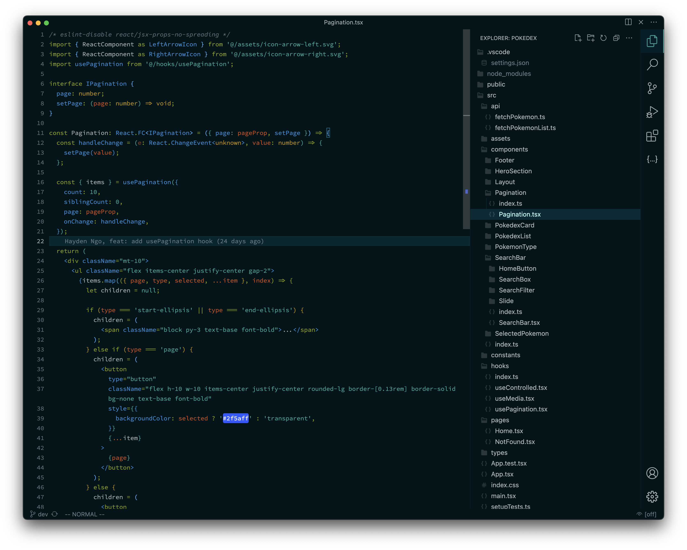
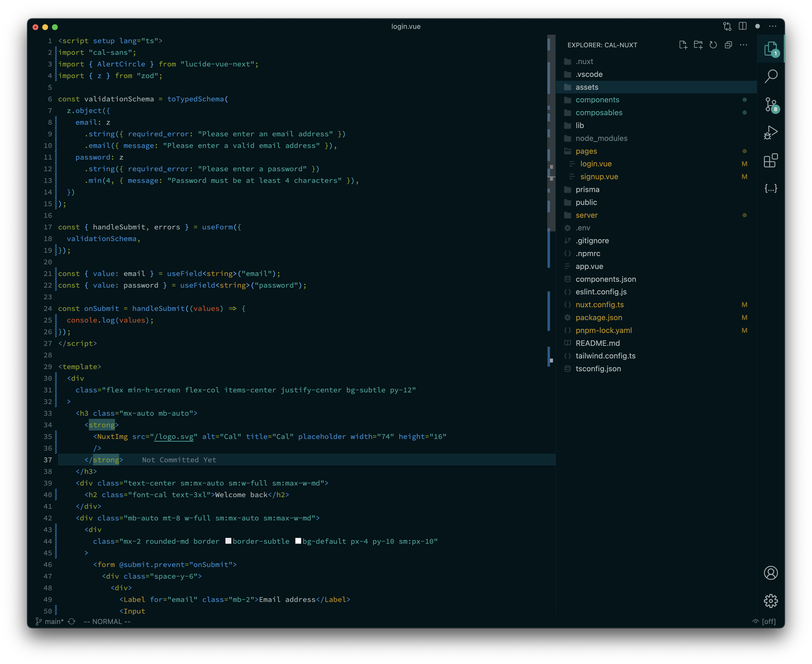
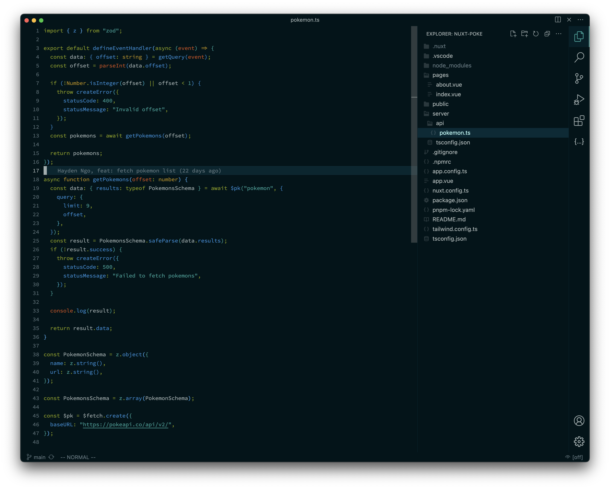
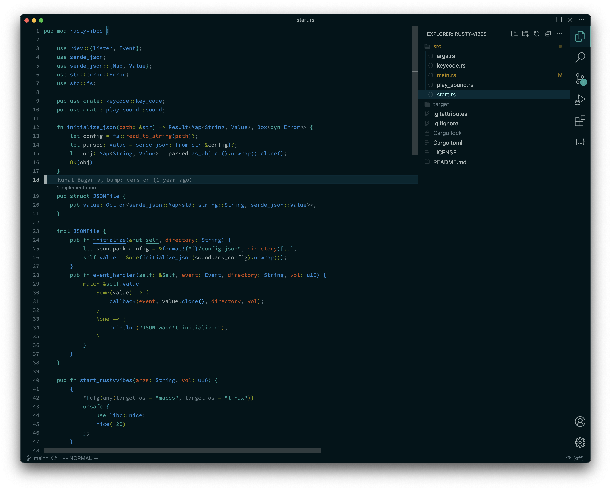

<h1 align="center">Solarized Osaka Theme for VS Code</h1>

<h3>A clean dark theme for Visual Studio Code base on Solarized Dark theme.</h3>

### React

### Vue

### TypeScript

### Rust

## TODO

- json key value is not right
- light version

## Thanks

This project is based on [solarized-osaka.nvim](https://github.com/craftzdog/solarized-osaka.nvim). If you use Neovim, you should try his theme, it is really cool!

## License

MIT - Copyright (c) 2023 Hayden Ngo  
